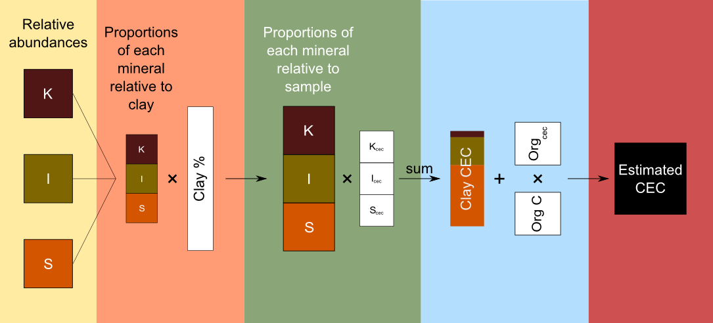
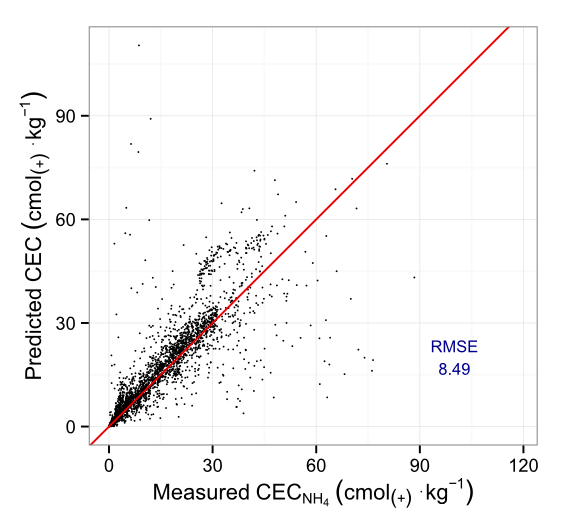
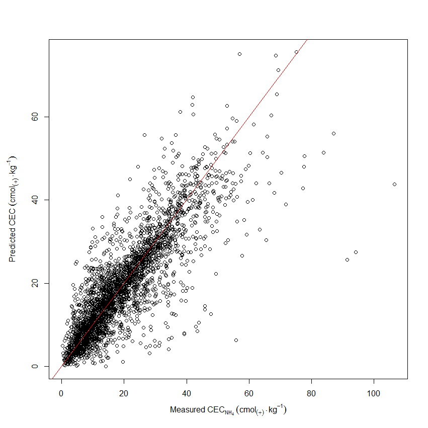

## Talk summary

- Background
- Model components
 - Empirical models
 - Mechanistic models
 - NIR spectra
- Project aims

---

## Soil carbon

- Climate change
- Carbon credits
- Soil fertility

---

## Topical

- Several projects around the world
 - GlobalSoilMap.net
 - National Soil Carbon Program
 - RaCA

--- .shout

## What's already out there?

---

## Empirical models

- All pedotransfer functions involving carbon
- Carbon spatial models
 - SSURGO
 - Kriging models

---

## Mechanistic models

- Work with carbon pools
 - Roth C
 - Century

---

## NIR spectra

- Light in 350-2500nm range
- Quick and cheap to measure
 - Relative to lab analysis

---

## How NIR is used

- Primarily in empirical models
 - Multiple linear regression
 - Boosted regression trees
 - Partial Least Squares
 - Principal Component Regression
- Used directly for prediction of a single soil property
 - e.g. carbon

---

## Problems

- All narrow in their focus
- No internal validation
 - If a prediction is off in obvious ways, it remains so

--- .shout

## The solution?

---

## Project aims

1. Generate empirical model to predict SOC from NIR spectra
 - Use this model for cheap NIR: Quick easy sampling
2. Combine spectral model with covariates to predict carbon at regional scale
 - Use MCMC
3. Use regional estimates as starting values for SOC mechanistic models
 - Predict soil carbon for next 30 years

***pnotes
Error propagation

--- .shout

## 1. Generating the empirical model

---

## Empirical model

Two stages
- Generate model with error checking
- Generate iterative model
 - Time permitting

---

## Error checking

- Use Cubist to generate starting values
- Generate models for several response variables
 - Compare responses for gross inconsistencies such as low pH and high calcium carbonate
 - Flag points

---

## Iterative model

- More ambitious
- Take flagged points and adjust until consistent
 - Make network of prediction paths
 - Weight methods by accuracy
 - Take path with lowest cost

--- .shout

## 2. Combining the spectral models

---

## Predicting at the regional scale 

- NIR models allow more points to be measured
 - NIR is cheap
 - Measuring soil carbon is not
- Use covariates from SSURGO
 - Use MCMC to make predictions

--- .shout

## 3. Temporal models

---

## Predicting at the regional scale *over time*

- Values for carbon now exist over entire regional scale
 - Use carbon models such as Roth C and Century
 - Predict carbon over regional scale for ~30 years

--- .shout

## What have you done so far?

---

## An example

Quantifying clay minerals using spectra, org C and clay

- Using spectra, org C and clay to predict soil minerals
 - Kaolinite, Illite and Montmorillonite
- Validate prediction using CEC

--- .cover .w

--- .cover .h

--- .cover .h

--- .shout

## In summary

---

## Cheat Sheet

<ul>
  <li>NIR is a cheap way to measure soil carbon</li>
  <li class="next">This fact allows multiple point measurements to be taken</li>
  <li class="next">Multiple point measurements allows more accurate extrapolation</li>
  <li class="next">Once regional models have been produced: predict stocks for next 30 years</li>
</ul>

---

## Acknowledgements

- Alex
- Budi
- RaCA and Florida
- Friends and Friends
