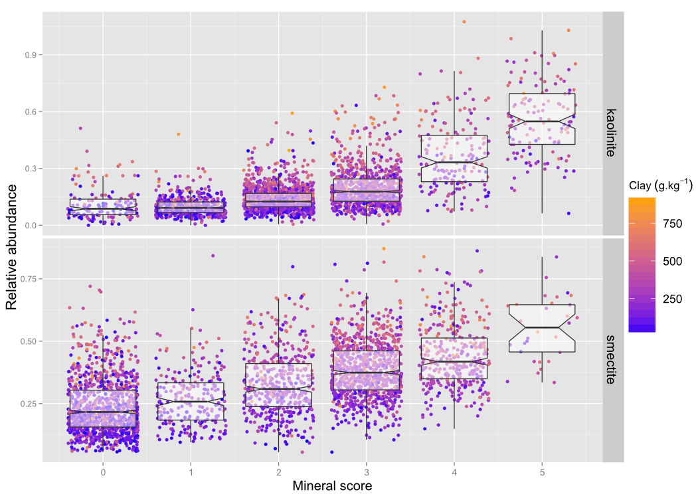

## Talk summary

- Everybody Loves Carbon
 - But only alone
- Keeping carbon company
- An example

---

## What's the problem?

- Everyone's interested in carbon
 - GlobalSoilMap.net
 - National Soil CArbon Program
 - RaCA
- It's irksome to measure
 - Lab equipment
 - Time and expertise

---

## What do we really want to predict?

-  Soil Organic Carbon
 - Not carbon over time
 - Not various carbon pools
- These other aspects can be added, but they are not the focus

--- .shout

## But what if our models don't make sense?

---

## Traditional modelling

Traditionally, empirical modelling has a singular goal:
- To estimate, using a range of soil properties (and spectra), a single soil property
- But what if our prediction doesn't make sense?
- If we get a pH of 4, the soil probably isn't high in $\sf{CaCO_{3}}$

---

## Existing carbon models used on spectra
- Empirical models
 - Multiple linear regression
 - Boosted regression trees
 - Partial Least Squares
 - Principal Component Regression

--- .shout

## What are we going to do about it?

---

## We think like scientists

- Predictions aren't valuable if they conflict with existing knowledge
- NIR spectra offer an opportunity
 - From one set of predictors, we can make a range of predictions and check them for sanity

---

## What benefit is this really going to offer?

- Sensible modelling
 - Results are checked to some degree for sanity
- The ability to do some degree of verification for soil properties which cannot be directly measured

--- .shout

## Nice idea. But how?

---

## Model summary

- Generate starting values (existing Cubist models)
- Select property of interest (e.g. soil carbon)
- Read in all pedotransfer functions containing this property
- Find the most common predictor
- 

***pnotes
Maybe a picture here? Link to impress.js presentation?

---

## An example

Quantifying clay minerals using spectra, org C and clay

- Using spectra, org C and clay to predict soil minerals
 - Kaolinite, Illite and Montmorillonite

---

## First we'll need some training data

- RaCA data
 - 3171 horizons in continental US
 - NIR spectra (350 - 2500nm)
 - Org C (%), clay (%), $\sf{CEC_{NH_{4}}}$

--- .cover .w

---

## Process the data

- Smooth and snip
 - Filter the spectra and isolate diagnostic range
 - Remove convex hull
 - Find peak in diagnostic range (maximum)
- Compare peak to diagnostic peak
 - Obtain relative abundance

--- .cover .w

--- .cover .h

---

## Validation

- Cross check with Washington data
 - Spectra
 - Lab measurements
 - Minerals

--- .cover .h

--- .cover .h

---

## How that fits in

- Creating models which better use existing knowledge
- This model allowed us to make a prediction of a difficult to measure property.

--- .shout

## So to recap...

---

## Recap

- Carbon models at present predict one thing at a time
- Using multiple responses in conjunction with each other yields two major benefits
 - Prediction of sane responses
 - Prediction of responses for which direct prediction is difficult

---

## References

- Like you're going to read them anyway

---

## Acknowledgements

- Alex
- Budi
- RaCA/Florida
- Washington
- Etc.
